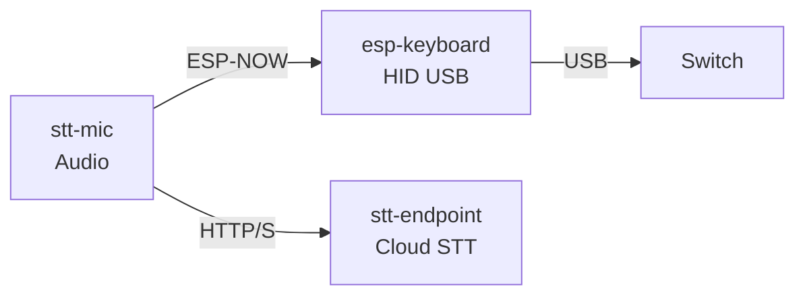

# STT Switch Pen

A speech-to-text system consisting of three sub-projects that work together to capture audio, transcribe it using Google Cloud Speech-to-Text, and output the transcribed text via ESP-NOW to a keyboard emulator connected to the Nintendo Switch 2.

## System Architecture

## Sub-Projects

### 1. stt-mic
**Purpose:** Audio capture and speech-to-text communication

**Hardware:** ESP32-based microcontroller with I2S microphone

**Key Features:**
- Captures audio using I2S microphone interface
- Streams audio data to the stt-endpoint via HTTP/S for transcription
- Sends transcribed text to `esp-keyboard` via ESP-NO
- Implements power management with auto-sleep after 30 seconds of inactivity
- Button-activated recording

**Technology Stack:**
- C++ (Arduino framework)
- PlatformIO build system
- ESP-NOW for low-latency local communication
- WiFi for cloud connectivity

### 2. stt-endpoint
**Purpose:** Cloud-based speech recognition service

**Platform:** Go-based HTTP server deployed to Google Cloud Run

**Key Features:**
- RESTful API endpoint for audio transcription
- Integration with Google Cloud Speech-to-Text API v2
- Supports both normal and streaming recognition modes
- Configurable audio parameters (sample rate, encoding)

**Technology Stack:**
- Go
- Google Cloud Speech-to-Text API
- Docker containerization
- Google Cloud Run for hosting
- Terraform for IaC

### 3. esp-keyboard
**Purpose:** Wireless keyboard emulation

**Hardware:** ESP32-based microcontroller with ESP-NOW

**Key Features:**
- Acts as a HID boot keyboard
- Receives transcribed text via ESP-NOW
- Types the received text as keyboard input to paired device
- LED feedback for status indication

**Technology Stack:**
- C++ (Arduino framework)
- PlatformIO build system
- ESP-NOW receiver
- Adafruit TinyUSB library

## Communication Flow

1. **Audio Capture:** User presses button on stt-mic → records audio via I2S microphone
2. **Transcription:** stt-mic sends audio data to stt-endpoint → Google Cloud Speech-to-Text processes audio
3. **Text Delivery:** stt-endpoint returns transcribed text → stt-mic forwards to esp-keyboard via ESP-NOW
4. **Output:** esp-keyboard types the text into the connected device

## Development Setup

Each sub-project has its own build system:

- **stt-mic** and **esp-keyboard:** Use PlatformIO (`platformio.ini`)
- **stt-endpoint:** Use Go modules (`go.mod`) with Docker support

## Configuration

Both ESP32 projects require a `secrets.h` file in their `include/` directories with WiFi credentials and device-specific settings. The `stt-endpoint` requires Google Cloud credentials and a recognizer name configured via environment variables.
